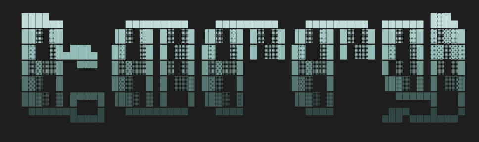
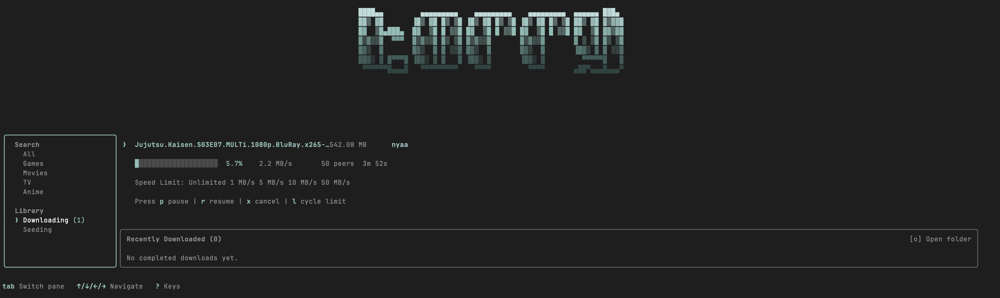
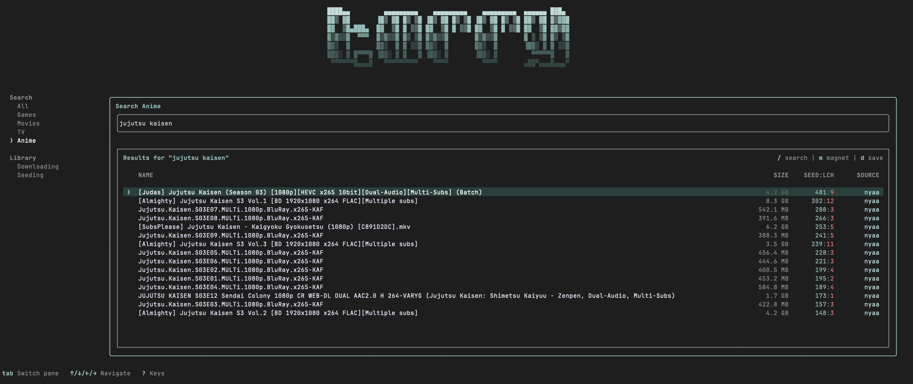

<div align="center">
  
</div>

<div align="center">
  <a href="https://github.com/fs0cietyx/torry/actions"></a>
  <a href="https://www.npmjs.com/package/@fs0cietyx/torry"></a>
  <a href="https://opensource.org/licenses/MIT"></a>
</div>

<br>
<div align="center">
  
  <br>
  <em>Screenshot of torry's starting home page (search interface)</em>
</div>
<br>

## Introduction

`torry` is a cross-platform, terminal-based torrent search engine and client. 

Finding a torrent these days sucks. One site is a minefield of fake download buttons. Another hides the real link under a popup that spawns two more tabs. `torry` solves this by moving the entire experience to the terminal. It searches a short, curated list of reputable sources at once, and whatever you pick downloads straight to your computer using a hyper-optimized Rust engine.

`torry` is built using a unique hybrid architecture:
- **Frontend**: A highly interactive Terminal UI built with React/Ink and TypeScript.
- **Backend/Engine**: A native, zero-copy BitTorrent client written in Rust (bound to Node.js via NAPI-RS).

Downloads run completely in the background via the Rust engine while you keep searching, meaning you can queue up as many as you want without slowing down the UI.

<br>
<div align="center">
  
  <br>
  <em>Screenshot of torry's active downloading page</em>
</div>
<br>

## Usage

If you have Node.js installed, you don't need to compile anything. `torry` pre-builds its Rust binaries for Windows, macOS, and Linux.

Run it instantly using `npx`:

```bash
npx @fs0cietyx/torry
```

### Quick Start

Some common actions to get you started with `torry`:

- **Search**: Type what you are looking for in the main bar and press `Enter`.
- **Download**: Use the `Arrow` keys to select a result and press `Enter`.
- **Direct Links**: Paste a magnet link or a bare infohash directly into the search bar.
- **Pause/Resume**: Select an active download in the queue and press `Space`.
- **Remove**: Select an active download and press `x`.
- **Help**: Press `?` at any time to open the keyboard shortcut menu.

Downloads save directly to your system's default `Downloads` folder, and their state is preserved in a local SQLite database so interrupted downloads pick up right where they left off.

## Build instructions

If you wish to contribute or build `torry` from source, follow these steps.

### Prerequisites

List of build-time dependencies:

- Node.js (v20 or newer recommended)
- `pnpm` package manager
- Rust toolchain (`rustup`, `cargo`, `rustc`)
- A standard C/C++ toolchain for native compilation (`build-essential` on Linux, Xcode Command Line Tools on macOS)

Install the required packages from your package manager:

**Debian/Ubuntu**
```bash
sudo apt install curl build-essential
curl --proto '=https' --tlsv1.2 -sSf https://sh.rustup.rs | sh
npm install -g pnpm
```

**macOS**
```bash
xcode-select --install
curl --proto '=https' --tlsv1.2 -sSf https://sh.rustup.rs | sh
brew install pnpm
```

### Compile from source

To compile from source, clone from the Git repository, then run the build scripts:

```bash
# 1. Clone the repository
git clone https://github.com/fs0cietyx/torry.git
cd torry

# 2. Install workspace dependencies
pnpm install

# 3. Compile the Rust engine and TypeScript CLI
bash scripts/build.sh
```

### Run Locally

To run your locally built development version:

```bash
pnpm dev
```

## Architecture & Repositories

`torry` is managed as a `pnpm` monorepo containing:

- `crates/core` - The core BitTorrent engine and network stack written in Rust.
- `packages/binding` - The NAPI-RS bridge that exposes the Rust core to Node.js.
- `packages/shared` - Shared TypeScript definitions and types.
- `packages/cli` - The React/Ink terminal UI application.

## Curated Sources

`torry` searches a hand-picked list of trusted sources via DHT/PEX.

| Category | Sources |
|---|---|
| **Games** | FitGirl |
| **Movies** | YTS, The Pirate Bay, 1337x |
| **TV** | EZTV, The Pirate Bay, 1337x |
| **Anime** | Nyaa, SubsPlease |

*Note: Games are the only category that can run code, so they come exclusively from FitGirl (a repacker with a long, trusted track record). Everything else is plain video and subtitles.*

## Privacy & Network

Your files stay on your disk, and nothing routes through a central server. `torry` only talks to the torrent network directly via standard trackers, DHT, and PEX. 

Once a download finishes, it keeps seeding by default, sharing it back so the next person can find it just as easily. The network only works because people pass things along, and even a few minutes makes a real difference. If you'd rather not, opt out anytime: just select the torrent and press `Space` to pause or stop it. Always your call.

## Support

If you have trouble running `torry`, please check whether the issue has already been reported in our GitHub issue tracker. If not, please file a new issue describing the problem, your operating system, and the terminal emulator you are using.

## License

MIT License.

## About

`torry` - curated torrents straight from your terminal.
