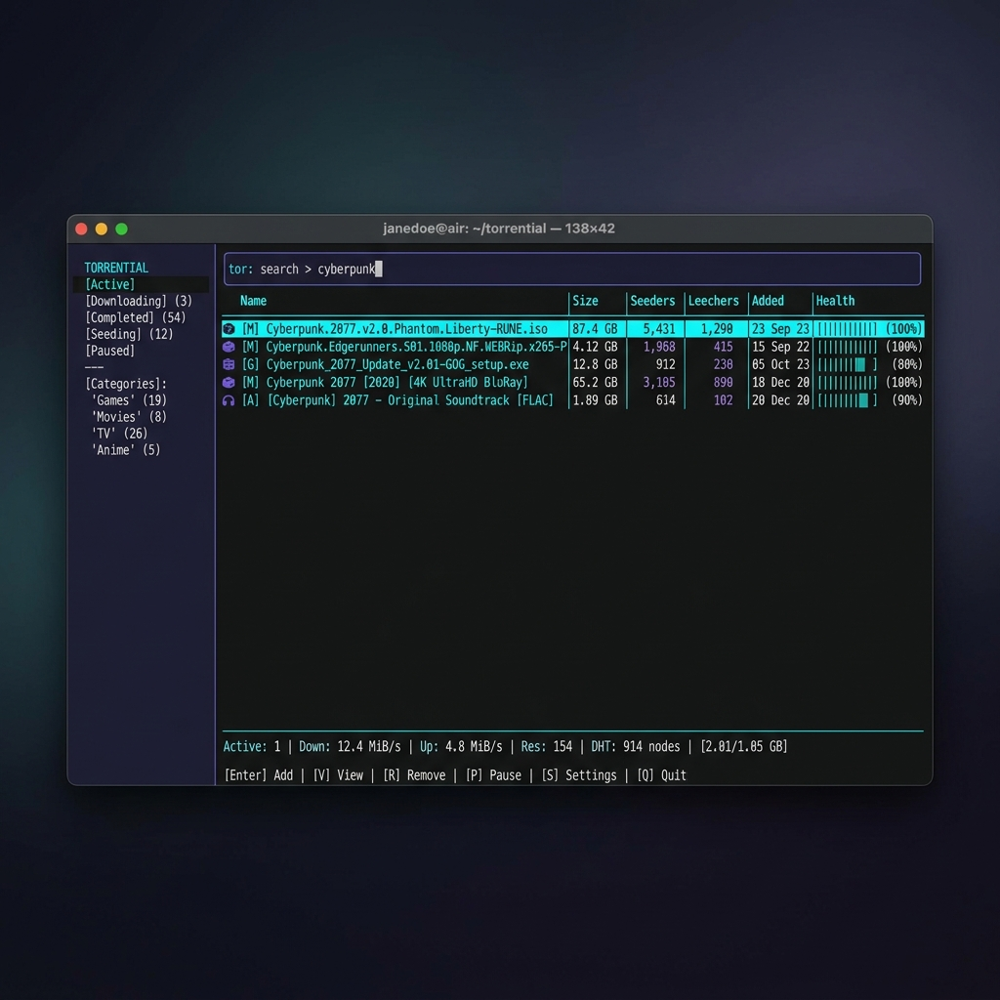
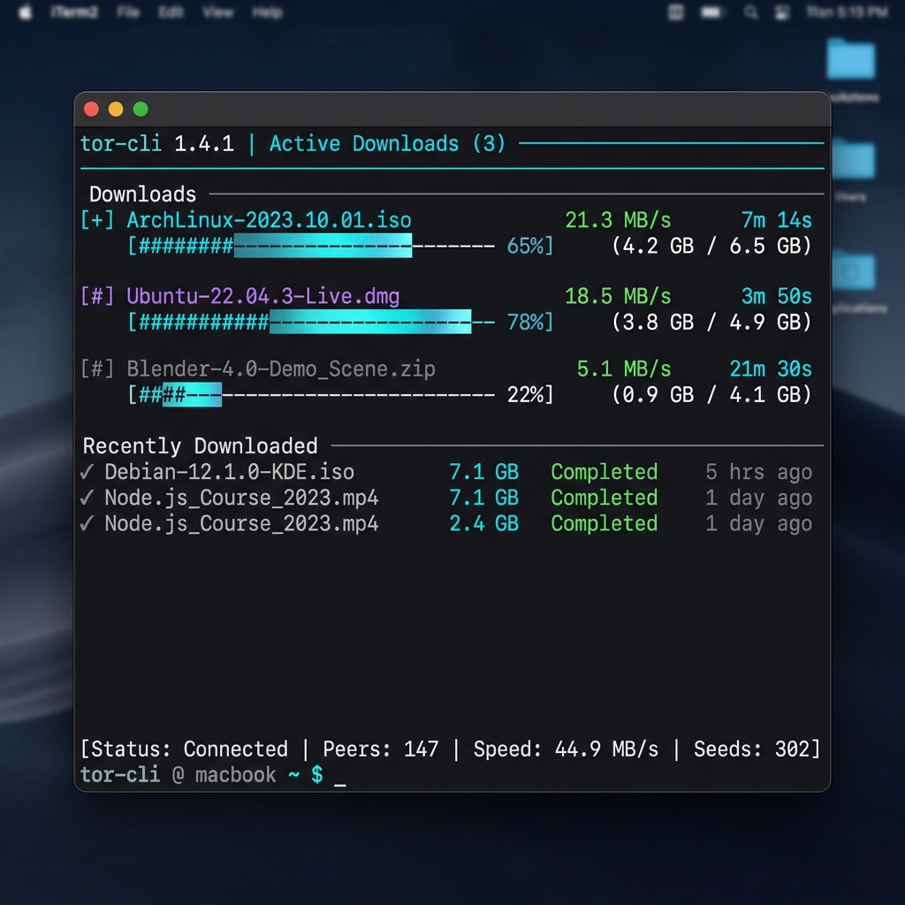

# torry, curated torrents straight from your terminal

Finding a torrent these days sucks. One site is a minefield of fake download buttons. Another hides the real link under a popup that spawns two more tabs. And after all that, half the results are dead, zero seeders.

torry is a blazing-fast torrent finder and client that lives in your terminal, with zero setup and nothing to configure. One search checks a short, curated list of reputable sources at once, and whatever you pick downloads straight to your computer using a hyper-optimized Rust engine. The files are yours, saved right to your downloads folder.

## Get started

Install Node (from nodejs.org) and Rust (from rustup.rs).

Open your terminal.

Start it:

```bash
git clone https://github.com/fs0cietyx/torry.git
cd torry
pnpm install
bash scripts/build.sh
pnpm dev
```

That's all you'll type. torry opens straight to a search bar: search for what you want, paste in a magnet link or a bare infohash, or just press Enter on an empty box to browse the curated library. From there it's all keypresses, nothing to memorize, and `?` brings up the full list of shortcuts anytime.

## Finding something

Type what you're looking for and press Enter. Results stream in from every source as they answer, tagged with size and how many people are sharing each one, so you can see what'll come down fast. Arrow to what you want and press Enter to save it.



## Your downloads

Active downloads sit up top with their progress, speed, and time left; when one finishes it stays in the list so you can see it's done. Everything's still there when you come back, and anything interrupted picks up right where it left off, supported by local SQLite state saving. 

Downloads run in the background via a zero-copy Rust engine while you keep searching, so you can queue up as many as you want without slowing down the UI. They save to your downloads folder, and the pane keeps tabs on each one. When something finishes it keeps seeding automatically so the next person can find it too. You can pause, resume (Space), or delete (x) them at any time.



## What it searches

A short, hand-picked list of trusted sources:

| Category | Sources |
|---|---|
| **Games** | FitGirl |
| **Movies** | YTS, The Pirate Bay, 1337x |
| **TV** | EZTV, The Pirate Bay, 1337x |
| **Anime** | Nyaa, SubsPlease |

Games are the only category that can run code, so they come from FitGirl alone, a repacker with a long, trusted track record; everything else is plain video and subtitles. If a source is down, the search carries on without it, and torry tells you which one is offline.

## Contributing

To run or work on torry locally:

1. Clone the repository and open the folder.
2. Install dependencies:
   ```bash
   pnpm install
   ```
3. Build the ultra-fast Rust engine and TypeScript layers:
   ```bash
   bash scripts/build.sh
   ```
4. Run the development version:
   ```bash
   pnpm dev
   ```

Before opening a PR, ensure your code compiles cleanly (`cargo clippy --workspace --all-targets -- -D warnings`) and matches the existing architectural split (Rust engine in `crates/`, React TUI in `packages/cli/`).

## Privacy

Your files stay on your disk, and nothing routes through a central server; torry only talks to the torrent network directly via DHT, PEX, and standard trackers. Once a download finishes it keeps seeding by default, sharing it back so the next person can find it just as easily. The network only works because people pass things along, and even a few minutes makes a real difference. If you'd rather not, opt out anytime: just select the torrent and press `Space` to pause or stop it, and press it again to pick it back up. Always your call.
